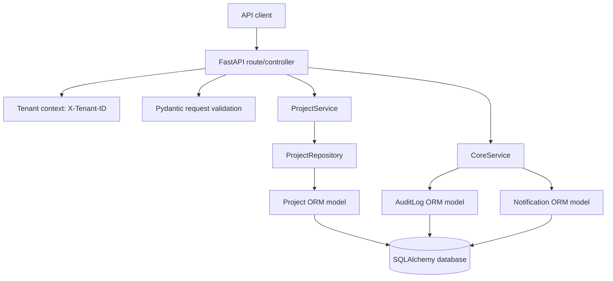

# Architecture and Flow

## Layered architecture

## Request flow

1. A client sends a request with validated JSON and an `X-Tenant-ID` header.
2. FastAPI resolves the tenant and database-session dependencies.
3. Pydantic schemas validate request fields and enum values.
4. The route delegates business behavior to `ProjectService` or `CoreService`.
5. Services enforce tenant/recipient authorization, normalize input, manage commits, and emit structured logs.
6. The project repository uses SQLAlchemy queries for project persistence. Core service operations persist audit and notification ORM models.
7. The route maps domain errors to stable HTTP responses and serializes ORM objects through response schemas.

## Multi-tenant boundary

Tenant identity is required at every project, audit, and notification endpoint. Repository and service queries include `tenant_id`; notification reads and updates also require the recipient ID. The current header is a demonstration boundary and should be replaced with tenant context derived from verified authentication in production.